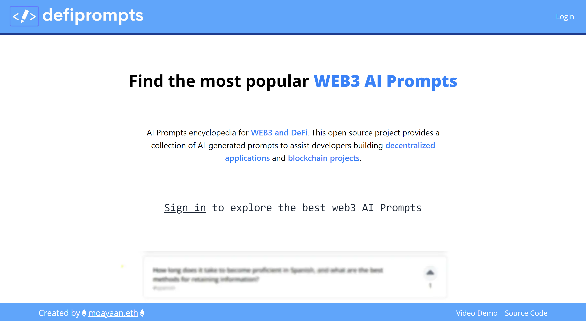
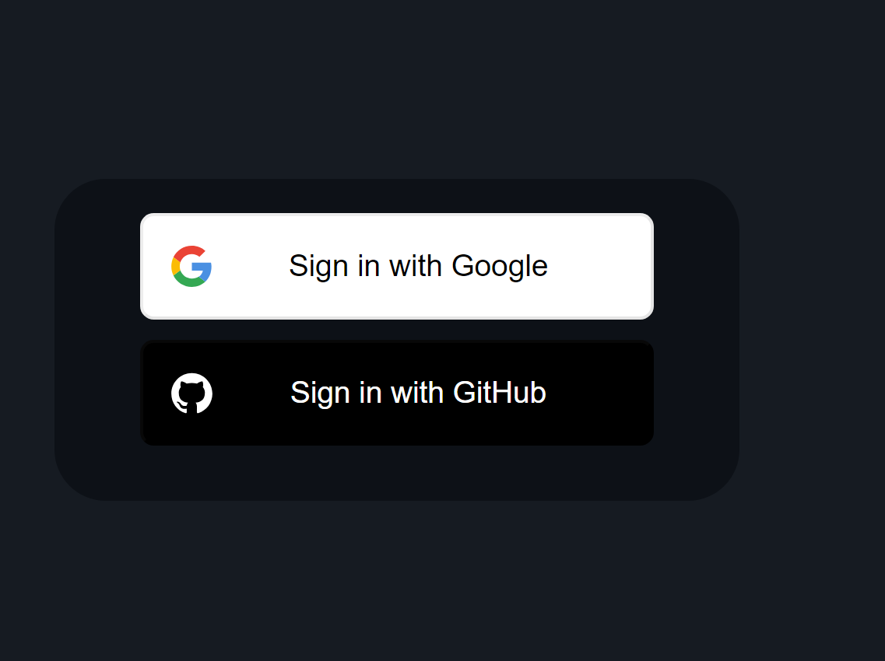
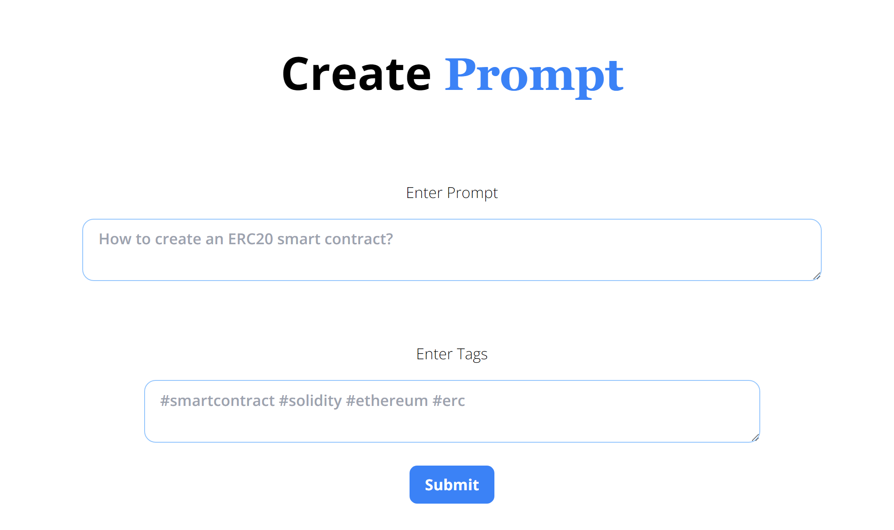
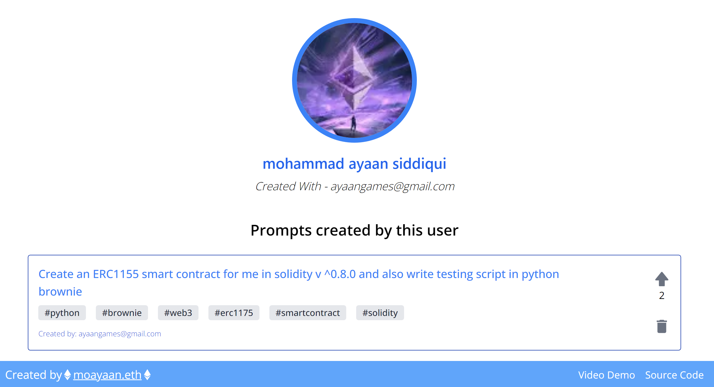

<!-- @format -->

# defiPrompts

defiPrompts is an AI prompts encyclopedia for WEB3 and DeFi. This open source project provides a collection of AI-generated prompts to assist developers building decentralized applications and blockchain projects.

## Links

### Video Demo

[https://youtu.be/lbQdt8Mfkv8]

### Live Site

[https://defiprompts.vercel.app/]

## Features

- 💡 Large collection of prompts for DeFi and WEB3
- 🔎 Search prompts by keywords
- ✍️ Submit new prompts to expand the collection
- ⭐ Upvote useful prompts
- 🤖 AI-generated prompts for natural responses
- 📃 Browse prompts by tags
- 🔐 User authentication
- 📱 Responsive design

## Tech Stack

- [Next.js](https://nextjs.org/) - Framework for React apps
- [MongoDB](https://www.mongodb.com/) - Database to store prompts
- [React](https://reactjs.org/) - Frontend framework
- [Tailwind CSS](https://tailwindcss.com/) - Styling
- [Vercel](https://vercel.com/) - Deployment platform
- [Mongoose](https://mongoosejs.com/) - MongoDB ODM
- [NextAuth](https://next-auth.js.org/) - Authentication

## Preview

## About

Hello everyone, myself **Mohammad Ayaan Siddiqui** from India. I am a Full Stack WEB3 developer and a **DECENTRALIZATION MAXI**. Currently working as TECHNICAL CO-FOUNDER in a web3 startup based in Netherlands.

 

If you are interested in either of the topics or building in similar skills, connect with me below:-

1.  [My Taplink Dashboard](https://moayaan.taplink.ws/)

2.  [My Linktree with ALL SOCIALS](https://linktr.ee/ayaaneth)
3.  [Connect on Github](https://github.com/moayaan1911)
4.  [Connect on Linkedin](www.linkedin.com/in/ayaaneth)
5.  [Connect on Hashnode](https://moayaan.hashnode.dev/)
6.  [Connect on Telegram](https://t.me/usdisshitcoin)
7.  [Connect on dev.to](https://dev.to/moayaan1911)
